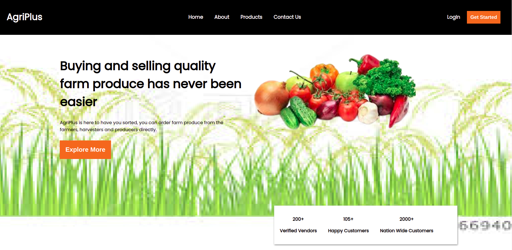
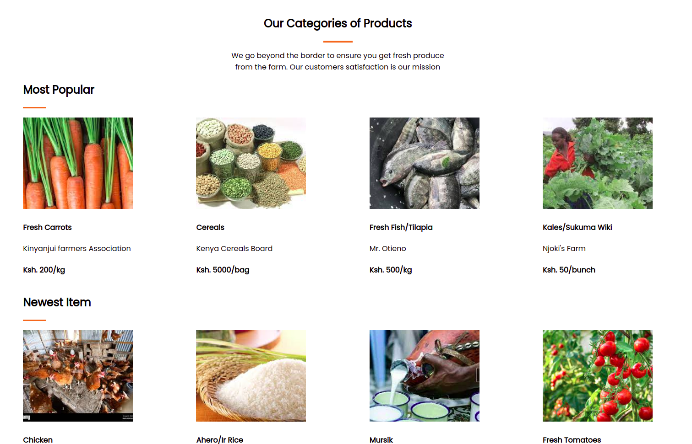

# AgriPlus Website
***

## Describtion
This websites helps farmers country wide to sell and buy products from the best producers

## Demo
Use the link provided to navigate to the AgriPlus website.
[AgriPlus](https://sheetabz.github.io/AgriPlus-Website/)<br>

The page appears as shown below and has the following feaures:
- This the landingpage

- Other pages<br>


## Technologies used & Features
- Well designed and responsive UI
- HTML
- CSS

## Future-implementations 
- JavaScript
- Search APIs

## Contribution
If you need to contribute to this project follow the steps below:<br>
- Clone the repo(`git clone <repo link>`)
- Create a branch where you will add changes (`git branch -b <branchname>`)
- Add the changes (`git add .`)
- Commit changes (`git commit -m"contributing changes"`)
- Push your changes (`git push origin <branchname>`)

## Code Samples
```Html
  <div class="container">
  <!-- NAVIGATION BAR -->
        <nav>
            <label for="" class="logo">AgriPlus</label>
        
            <ul>
                <li><a href="" class="home">Home</a></li>
                <li><a href="">About</a></li>
                <li><a href="">Products</a></li>
                <li><a href="">Contact Us</a></li>
            </ul>
            <div class="rightnav">
                <label for="" class="login"><a href="">Login</a></label>
                <button class="button">Get Started</button>
            </div>
        
        </nav>

        <!-- HOME PAGE CONTENT -->
        <div class="containers" id="home">
            <div class="content">
                <h1>Buying and selling quality farm produce has never been easier</h1>
                <p>AgriPlus is here to have you sorted, you can order farm produce from the farmers, harvesters and
                    producers directly.</p>
                <button class="button"><a>Explore More</a></button>
            </div>
            <div class="image">
                
            </div>
        </div>
    </div>
```
```Css
nav{
    background-color: #000000;
    color: #FFFFFF;
    height: 15%;
    display: flex;
    flex-direction: row;
    justify-content: space-between;
    align-items: center;
    padding: 0px 40px;
}
nav>ul{
    display: flex;
  }
  nav>ul>li{
      
      display: inline-block;
      margin-right: 40px;
      font-size: 1.1rem;
      font-weight: bolder;
  
  }
```
### Author
[](https://github.com/SheeTabz)<br>
[TABITHA MURIITHI](https://github.com/SheeTabz)

## License information.
### MIT License
[](https://opensource.org/licenses/MIT)  
`[](https://opensource.org/licenses/MIT)`

